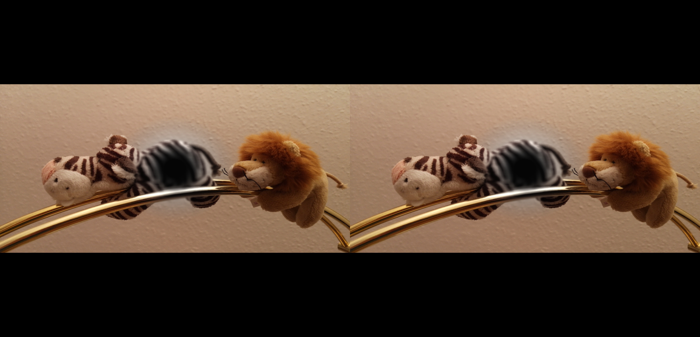

# Visual System Simulator (VSS)

VSS is a cross-platform framework for simulating various aspects of the [human visual system](https://en.wikipedia.org/wiki/Visual_system) such as [eye diseases](https://en.wikipedia.org/wiki/Eye_disease). This project is maintained by the [Visualization Research Center](https://visus.uni-stuttgart.de/) at the [University of Stuttgart](https://www.uni-stuttgart.de/).

<p align="center">
	 
	 
</p>
Android app running simulation of marcular degeneration (left) and desktop app running simulation of nyctalopia, also known as night-blindness (right).

## Contents

- [Installation and Usage](#Installation)
  - [Desktop App](#Desktop)
  - [Android App](#Android)
  - [Web App](#Web)
- [Configuration](#Configuration)
- [Citing](#Citing)
- [Versioning](#Versioning)
- [License](#License)

## <a name="Installation"></a>Installation

### Option 1: binary builds (easier)
- Android: install from [Google Play Store](), TODO: add link
- Desktop: download and install a package from the [release page](https://github.com/UniStuttgart-VISUS/visual-system-simulator/releases)

### Option 2: source builds
- Clone this repository
- Make sure you have Rust installed (e.g. using [rustup](https://rustup.rs/))
- For the impatient `cargo run -- --config assets/configs/macular-degeneration-medium.json image assets/cube.color.png`
- Optional: [Desktop build](#Desktop_Build)
- Optional: [Android build](#Android_Build)
- Optional: [Web build](#Web_Build)

### Supported systems:

Android | Desktop
--- | ---
64bit ARM | 64bit x86-64 CPU 
OpenGL ES 3.3+ | OpenGL 3.3+
API level 25+ | Linux/macOS/Windows

## <a name="Desktop"></a>Desktop App

The desktop app has a command-line interface (see `--help`).
However, you may use the web interface [web interface](#Web) for remote control.

### <a name="Desktop_Build"></a>Building from Source

Again, you need to have Rust installed. Then run `cargo build --release`. You can find the binaries in `target/release`.

### Enabling Video Support

To enable video file support (MP4, AVI, etc.), you have to install [libav 4.x (FFmpeg)](https://www.ffmpeg.org/download.html). Linux users know what to do here. Windows users may extract the pre-compiled binaries to `<FFMPEG_HOME>` and add the following paths to their environment variables `C_INCLUDE_PATH=<FFMPEG_HOME>/include`, `LIB=<FFMPEG_HOME>/lib`, and `PATH=<FFMPEG_HOME>/bin` so that the C++ compiler and runtime linker can use the library properly. Then, video support can be enabled using `cargo --features "video"`.

## <a name="Android"></a>Android App

You can access the simulation settings in the navigation drawer on the left side under "Simulation". You can open or collapse settings for a specific eye-disease by clicking it. To activate it, tap the corresponding toggle buttons. You can select multiple eye disease at once.

You can start the simulation by clicking the button in the bottom-right corner or "Start simulation" in the navigation drawer.

To learn more about the eye-diseases and their parameters, you can access the "Knowledgebase" in the navigation drawer.

If you have a head mount such as Google Cardboard, you can turn on the "Splitscreen simulation" by activating it in the navigation drawer. Note that the camera on the back must be accessible, which may require drilling a small hole into the frame.


### <a name="Android_Build"></a>Building from Source

First, make sure the `android-sdk`, `ndk`, and `ndk-bundle` are installed. This can be done and verified using [Android Studio](https://developer.android.com/studio/). Probably, you want to install the JDK as well. If you get errors while building, you might have to adjust some environment variables (`JAVA_HOME`, `ANDROID_HOME`, and `PATH`) and accept licenses (`sdkmanager --licenses`) - and yes, Java developer environments are the apex of shit.

If you got everything right, you can go to `vss-mobile/android` and run `gradlew build`.

TODO: describe build steps here, where to find the APK and what to do with it.

## <a name="Web"></a>Web App

Currently, the web app only supports remote control (in-browser simulation depends on [gfx#1900](https://github.com/gfx-rs/gfx/issues/1900)). To connect to a remote endpoint:

1. First start the application you want to control remotely.
    - (Android only) Open the navigation drawer, enable "Remote Access".
2. Enter the URL of your device, e.g., `http://127.0.0.1:3000`.
3. Click "connect" and let the web app connect to the remote endpoint.
4. Once this is done, changes in the web app will be applied to the remote endpoint.

The Simulation settings in the tab "Settings" are analogue to the ones in the Android app.

In the "Import/Export" tab you can load and save your settings.

In the "Upload" tab you can set input stimuli, the cornea map, and the retina map.

In the "Draw" tab you can draw your own retina maps and inputs.

By opening the web app and connecting the android device to the server one can remotely control the device's simulation settings via the web app.
The following steps have to be taken.

### <a name="Web_Build"></a> Building from Source

You need to have [Node.js](https://nodejs.org/) installed. Then, enter the `vss-web` web directory, run `npm install`, and then `npm run build` . You can find the release files under `vss-web/dist`.

## <a name="Configuration"></a>Configuration

TODO: document missing parameters

### Corneal Map 
 
The corneal map can be used to describe deformations of the cornea in the simulation. While this is not a fully realistic simulation of a real cornea, it allows for effective eye-disease simulation. For now, the corneal map describes for each position on the outside of the cornea how the light rays are deflected in addition to normal light refraction. The encoding is as follows:
 
- A high red value results in a deflection to the right 
- A low red value results in a deflection to the left 
- A high green value results in an upward deflection 
- A low green value results in a downward deflection 

### Retina Map

The retina map can be used to describe the distribution and sensitivity of cone cells and rod cells. The encoding is as follows:

- Red for red-sensing cone cells
- Blue for blue-sensing cone cells
- Green for green-sensing cone cells
- Alpha for rod cells

## <a name="Citing"></a>Citing

```bibtex
@InProceedings{Schulz2019Framework,
  author    = {Schulz, Christoph and Rodrigues, Nils and Amann, Marco and Baumgartner, Daniel and Mielke, Arman and Christian, Baumann and Sedlmair, Michael and Weiskopf, Daniel},
  booktitle = {IEEE Conference on Virtual Reality and 3D User Interfaces (VR)},
  title     = {A Framework for Pervasive Visual Deficiency Simulation},
  year      = {2019},
  pages     = {1-6},
  doi       = {10.1109/VR44988.2019.9044164},
}
```

## <a name="Versioning"></a>Versioning

This project is maintained under the [Semantic Versioning](http://semver.org/) guidelines.

## <a name="License"></a>License

Licensed under the [Apache 2.0 License](https://www.apache.org/licenses/LICENSE-2.0). Copyright &copy; 2017 [University of Stuttgart](https://www.uni-stuttgart.de/).
