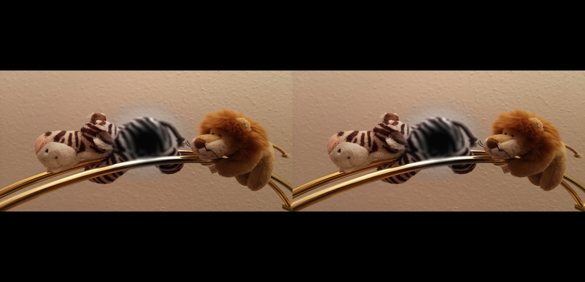

# Visual System Simulator (VSS)

VSS is a cross-platform framework for simulating various aspects of the [human visual system](https://en.wikipedia.org/wiki/Visual_system). This project is maintained by the [Visualization Research Center](https://visus.uni-stuttgart.de/) at the [University of Stuttgart](https://www.uni-stuttgart.de/).

<p align="center">
	 
	 
</p>
Android app running simulation of marcular degeneration (left) and desktop app running simulation of nyctalopia, also known as night-blindness (right). 

## Features

The simulation models physical aspects of light (scattering, refraction, etc.) and biological aspects of the human visual system (lens, retina, etc.). Thus, it is possible to simulate several [eye diseases](https://en.wikipedia.org/wiki/Eye_disease), such as:

- Degenerated lenses (cataracts)
- Congenital and age-related near- and farsightedness (myopia, hyperopia, presbyopia)
- Night blindness (nyctalopia)
- Color blindness (protanopsia, deuteranopsia, tritanopsia, achromatopsia)
- Gaps in the field of vision (macular degeneration)
- Optical nerve damage (glaucoma)


## Contents

- [Installation and Usage](#Installation)
  - [Desktop App](#Desktop)
  - [Android App](#Android)
  - [Web App](#Web)
- [Configuration](#Configuration)
- [Citing](#Citing)
- [Versioning](#Versioning)
- [License](#License)

## <a name="Installation"></a>Installation

### Option 1: binary builds (easier)
- Desktop: download and install a package from the [release page](https://github.com/UniStuttgart-VISUS/visual-system-simulator/releases)

### Option 2: source builds
- Clone this repository
- Make sure you have Rust installed (e.g. using [rustup](https://rustup.rs/))
- For the impatient: `cargo run` (see `Desktop App` below)
- Optional: [Desktop build](#Desktop_Build)
- Optional: [Android build](#Android_Build)
- Optional: [Web build](#Web_Build)

### Supported systems:

Android | Desktop
--- | ---
64bit ARM | 64bit x86-64 CPU 
OpenGL ES 3.3+ | OpenGL 3.3+
API level 25+ | Linux/macOS/Windows

## <a name="Desktop"></a>Desktop App

The desktop app has a command-line interface with two subcommands:

- `show` starts the interactive simulation
- `render` renders a batch of one or more inputs non-interactively

You can inspect the available flags with `cargo run -p vss-desktop -- --help`. Configs may be supplied using `--config` or using sidecar files, e.g., `cube.color.png.vss.json`.

Examples:

- `cargo run -p vss-desktop -- show assets/cube.color.png`
- `cargo run -p vss-desktop -- show --openxr=auto assets/cube.color.png`
- `cargo run -p vss-desktop -- render --output '{dirname}/{stem}.vss.{extension}' 'assets/*.png'`
- `cargo run -p vss-desktop -- render --config 'vss-catalog/presets/**/*.json' assets/marketplace.png`

The render command accepts repeated configuration files and configuration glob patterns. The default
output name includes the config stem, or `vss` when no config is supplied. Custom output patterns can
use `{config}`, for example `--output 'output/{config}/{stem}.{extension}'`.

### <a name="Desktop_Build"></a>Building from Source

Again, you need to have Rust installed. Then run `cargo build --release`. You can find the binaries in `target/release`.

### Enabling Video Support

To enable video file support (MP4, AVI, etc.), you have to install [libav 4.x (FFmpeg)](https://www.ffmpeg.org/download.html), e.g., `ffmpeg-n4.4-latest-win64-lgpl-shared-4.4.zip`. Linux users know what to do here. Windows users may extract the pre-compiled binaries to `<FFMPEG_HOME>` and add the following paths to their environment variables `FFMPEG_INCLUDE_DIR=<FFMPEG_HOME>/include`, `FFMPEG_LIB_DIR=<FFMPEG_HOME>/lib`, and `PATH=<FFMPEG_HOME>/bin` so that the C++ compiler and linker can use the library. Then, video support can be enabled using `cargo build --features "video"`.

## <a name="Android"></a>Android App

You can access the simulation settings in the navigation drawer on the left side under "Simulation". You can open or collapse settings for a specific eye-disease by clicking it. To activate it, tap the corresponding toggle buttons. You can select multiple eye disease at once.

You can start the simulation by clicking the button in the bottom-right corner or "Start simulation" in the navigation drawer.

To learn more about the eye-diseases and their parameters, you can access the "Knowledgebase" in the navigation drawer.

If you have a head mount such as Google Cardboard, you can turn on the "Splitscreen simulation" by activating it in the navigation drawer. Note that the camera on the back must be accessible, which may require drilling a small hole into the frame.


### <a name="Android_Build"></a>Building from Source

First, make sure the `android-sdk`, `ndk`, and `ndk-bundle` are installed. This can be done and verified using [Android Studio](https://developer.android.com/studio/). Probably, you want to install the JDK as well. If you get errors while building, you might have to adjust some environment variables (`JAVA_HOME`, `ANDROID_HOME`, and `PATH`) and accept licenses (`sdkmanager --licenses`) - and yes, Java developer environments are the apex of shit.

If you got everything right, you can go to `vss-android` and run `gradlew build`.

TODO: describe build steps here, where to find the APK and what to do with it.

## <a name="Web"></a>Web App

The static Vue application runs the Rust/WGPU simulator locally in current Chromium-based browsers with WebGPU. Images and videos are decoded and processed on-device. There is no camera, upload, telemetry, CDN, network API, or backend integration. Firefox and Safari are best effort and show a compatibility state when WebGPU is unavailable.

### <a name="Web_Build"></a> Building from Source

Install Rust, `wasm-pack`, Node.js 22 or newer, and npm 11. From `vss-web/app`, run `npm ci` and then use `npm run dev`, `npm run build`, or `npm test`. Each entry point builds the WASM package automatically. The static output is in `vss-web/app/dist`; relative asset URLs allow hosting below a URL subpath.

Dependency lifecycle scripts are disabled, and npm requires releases to be at least seven days old. There are currently no lifecycle-script or package-age exceptions. Any future exception must be narrowly documented here.

## <a name="Configuration"></a>Configuration

The canonical impairment presets live in `vss-catalog/presets`. They are sparse `both`/`left`/`right`
configuration layers and can be passed directly to `vss-desktop --config`. Article demonstrations refer
to these files by filename; the `vss-catalog` build fails when a preset has no article, an article has no
preset, a reference is unknown, locale assignments differ, or a referenced map asset is missing.

TODO: document missing parameters

### Corneal Map 
 
The corneal map can be used to describe deformations of the cornea in the simulation. While this is not a fully realistic simulation of a real cornea, it allows for effective eye-disease simulation. For now, the corneal map describes for each position on the outside of the cornea how the light rays are deflected in addition to normal light refraction. The encoding is as follows:
 
- A high red value results in a deflection to the right 
- A low red value results in a deflection to the left 
- A high green value results in an upward deflection 
- A low green value results in a downward deflection 

### Retina Map

The retina map can be used to describe the distribution and sensitivity of cone cells and rod cells. The encoding is as follows:

- Red for red-sensing cone cells
- Blue for blue-sensing cone cells
- Green for green-sensing cone cells
- Alpha for rod cells

## <a name="Citing"></a>Citing

```bibtex
@InProceedings{Schulz2019Framework,
  author    = {Schulz, Christoph and Rodrigues, Nils and Amann, Marco and Baumgartner, Daniel and Mielke, Arman and Christian, Baumann and Sedlmair, Michael and Weiskopf, Daniel},
  booktitle = {IEEE Conference on Virtual Reality and 3D User Interfaces (VR)},
  title     = {A Framework for Pervasive Visual Deficiency Simulation},
  year      = {2019},
  pages     = {1-6},
  doi       = {10.1109/VR44988.2019.9044164},
}
```

## <a name="Versioning"></a>Versioning

This project is maintained under the [Semantic Versioning](http://semver.org/) guidelines.

## <a name="License"></a>License

Licensed under the [Apache 2.0 License](https://www.apache.org/licenses/LICENSE-2.0). Copyright &copy; 2017 [University of Stuttgart](https://www.uni-stuttgart.de/).
