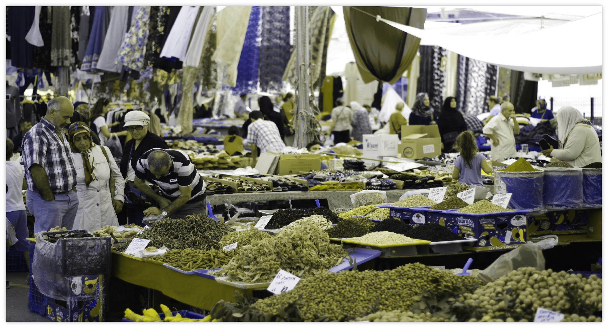
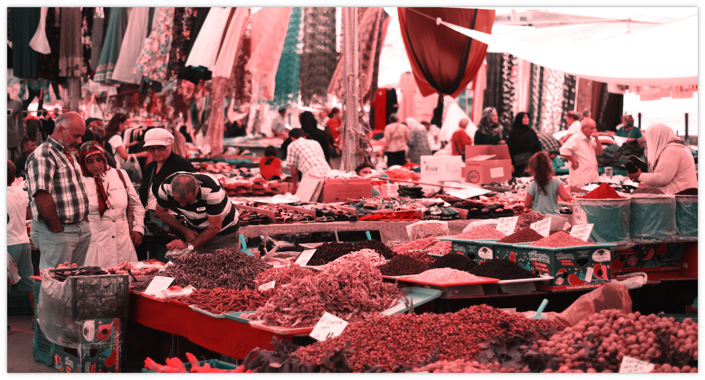
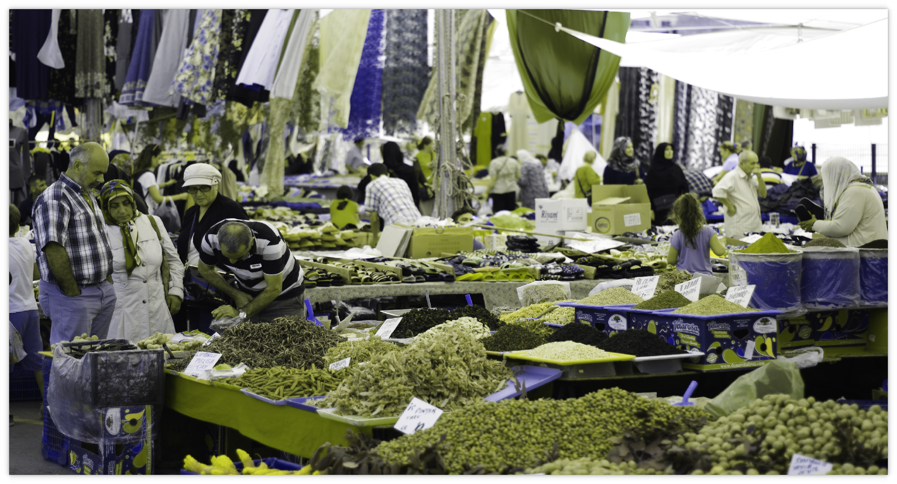

There are 3 types of colour vision defects: Red blindness, blue blindness and green blindness

 

 

 

## Causes and development

The malfunction of one of the 3 types of cones can severely impair a person's ability to perceive colour. In most cases, colour vision is congenital, but can also be caused by other diseases such as age-related macular degeneration and the use of drugs such as ethambutol.

## Symptoms

- **colour mix-up:** since one type of cone is less or no longer functional, the person concerned can hardly or not at all distinguish between 2 colours that would stimulate the afflicted cones in different ways

## Distribution

Approximately 8% of men and 0.4% of women worldwide are affected by colour vision problems.

## Therapy

To date, there is no therapy for color vision problems.
